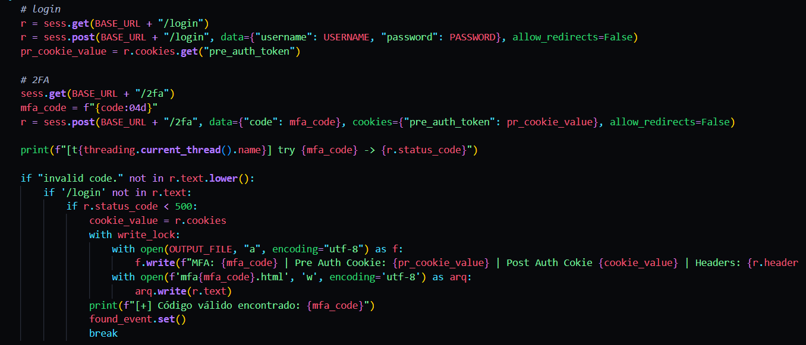
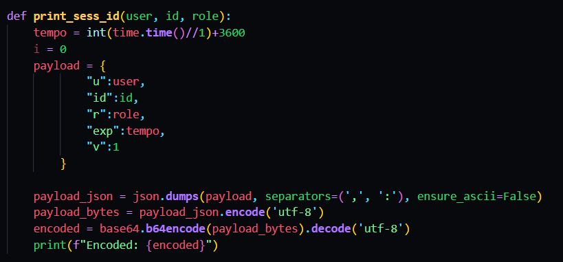
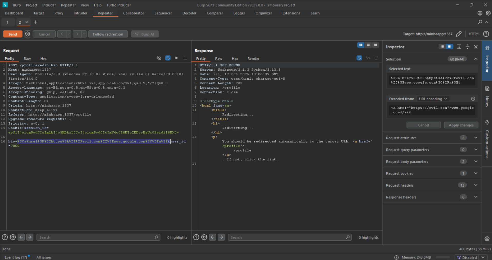

---
---
# GLHF - Good Luck Have Fun
por André Fonseca

### Cesar School  
### Ciência da Computação  
### Segurança Cibernética
### Professor: Henrique Arcoverde

Recife – PE  
16 de Outubro de 2025

---

## Resumo

### Objetivos
Avaliação de segurança da aplicação web GLHF, com foco na identificação de fraquezas e vulnerabilidades que possam ser exploradas por usuários ou malfeitores.

### Metodologia
A análise foi realizada manualmente por meio da exploração direta da aplicação, combinando técnicas de mapeamento de superfície de ataque, manipulação de requisições, análise de fluxos e verificação de comportamentos inesperados em funcionalidades críticas.

### Ferramentas
Firefox Devtools, Burp Suite Community, Scripts Python, VSCode e ambiente virtualizado Docker.

### Escopo
A avaliação foi conduzida em ambiente local com base nas instruções do repositório. Foram examinadas páginas públicas, fluxos de login e recuperação de conta, gerenciamento de pedidos e funcionalidades administrativas.

### Período da avaliação
- Início: 10/10/2025  
- Finalização: 16/10/2025

### Vulnerabilidades Identificadas
Foram identificadas 9 vulnerabilidades de segurança, classificadas conforme o OWASP Top 10:2021 e suas respectivas CWE. As falhas abrangem desde falhas de enumeração de usuários até falhas graves de autenticação e controle de acesso a painéis de administrador.

### Principais Impactos
- Falha na autenticação de sessão pelo backend  
- Cookies de sessão facilmente forjáveis  
- Exposição de estrutura interna do banco de dados através de injeção de SQL  
- Execução de código malicioso no cliente  
- Armazenamento inseguro de dados  
- Acesso completo a interfaces de administrador

---

| #   | Título                                                            | Endpoin(s)               | Parâmetro(s)             | Componente Afetado                                                              | Abrangência                            | OWASP    | CWE                                |
| --- | ----------------------------------------------------------------- | ------------------------ | ------------------------ | ------------------------------------------------------------------------------- | -------------------------------------- | -------- | ---------------------------------- |
| 1   | Enumeração de Usuários                                            | /login, /direct          | username, toUser         | backend (verificação de identidade)                                             | usuários não autenticados              | A07:2021 | CWE-204                            |
| 2   | Sistema vulnerável a brute-force                                  | /login, /mfa             | username, password, code | Backend (ausência de Rate Limiter), Backend (Mecanismo de autenticação)          | Usuários não autenticados              | A07:2021 | CWE-307                            |
| 3   | Token de Sessão previsíveis (Informações do Usuario e Time Based) | -                        | session_id (Cookie)      | Backend (Geração de Tokens)                                                     | Usuários autenticados                  | A02:2021 | CWE-330, CWE-311, CWE-326, CWE-340 |
| 4   | Escalação Horizontal                                              | /profile                 | bio, user_id             | Backend (Mecanismo de validação)                                                | Usuários autenticados                  | A01:2021 | CWE-284, CWE-639                   |
| 5   | Cross-Site Scripting                                              | /profile, /direct, /root | bio, message, toUser     | Frontend (Renderização de informações), Backend (Armazenamento sem codificação) | Usuários autenticados                  | A03:2021 | CWE-79, CWE-80                     |
| 6   | SQL Injection                                                     | /board                   | search                   | Backend (Queries do banco)                                                      | Usuários autenticados                  | A03:2021 | CWE-89                             |
| 7   | Insecure Direct Object References                                 | /static/avatars/{id}     | -                        | -                                                                               | Usuários autenticados/não autenticados | A01:2021 | CWE-284, CWE-639, CWE-200          |
| 8   | Armazenamento inseguro de dados críticos                          | -                        | -                        | Backend (Armazenamento de senha no banco), FrontEnd (Exposição dos dados)       | Usuários Autenticados                  | A02:2021 | CWE-326, CWE-759                   |
| 9   | Falha de autenticação na interface administrativa                 | /root                    | token                    | Sistema inteiro                                                                 | Root                                   | A05:2021 | CWE-656                            |

---

## Enumeração de Usuário
### Ponto Afetado: 
**Endpoint(s):** `/login, /direct`  
**Parâmetro(s):** `username, toUser`  
**Componente Afetado:** `backend (verificação de identidade)`  
**Abrangência:** `Usuários não autenticados`

### Descrição
Na exploração inicial foi possível identificar uma falha de enumeração de usuários no mecanismo de Login, que permite ao atacante saber quais usuários estão cadastrados no sistema por meio de diferenças na resposta da aplicação. Essa falha se dá pois a resposta da requisição possui algumas diferenças sutis. Mais adiante também foi encontrada uma falha de enumeração na página de `direct` onde o sistema indicava a existência de um usuário.

**Enumeração na página de login**  
Durante os testes foi possível identificar diferenças em requisições que apontavam para uma enumeração de usuários:

- **Tempo de resposta:** Para requisições que continham como `username` usuários existentes no banco, foi possível identificar um aumento significativo no tempo de resposta, com as requisições corretas tendo um tempo de espera de 100ms+. Como observado na imagem abaixo, tentativas de login para contas existentes possuem um tempo de espera e número de caracteres elevado.  
  

- **Diferença no HTML:** Ao inserir credenciais inválidas o código HTML da página apresentava sutis diferenças, com a div de classe `login-error` tendo seu comentário interno alterado:  
  - Resposta para usuário incorreto: `
Invalid credentials.<!-- id:0 -->
`  
	  
  - Resposta para usuários corretos: `
Invalid credentials.<!-- id:1 padding -------------- -->
`  
	

**Enumeração na página de direct**  
O fluxo de envio de mensagens para novos usuários possui uma falha de enumeração: caso um nome incorreto seja inserido o sistema retorna uma mensagem de erro dizendo "`usuario x não encontrado`".  

### Classificação
**OWASP Top-10:** A07:2021 Identification and Authentication Failures  
**CWE:** CWE-204

### Impacto
A capacidade de distinguir entre usuários existentes e inexistentes com base em diferenças no tempo de resposta e no conteúdo da resposta pode permitir a criação de uma lista de usuários válidos, facilitando ataques de força bruta, password spraying ou exploração de falhas de autenticação.

### Recomendações
- Implementar mecanismos de proteção contra automação (captcha, rate limiting, prova de trabalho).  
- Evitar envio de respostas explicitamente diferentes para casos de usuário inexistente vs senha incorreta.  
- Gerar alertas em caso de múltiplas requisições ou tráfego suspeito por IP.

---

## Ataques de Força Bruta
### Ponto Afetado: 
**Endpoint(s):** `/login, /2fa`  
**Parâmetro(s):** `username, password, code`  
**Componente Afetado:** `backend (mecanismo de autenticação), backend (ausência de rate limiter)`  
**Abrangência:** `Usuários não autenticados`

### Descrição
Após a enumeração de usuários, foi possível montar uma lista de usuários existentes no sistema e utilizar essa lista em um ataque de força bruta, realizando repetitivas requisições ao sistema em busca de mudanças na resposta (ex.: 302 para `/2fa`).

Foi encontrado um usuário válido com credenciais `usuario: windows96, senha: iloveyou2`.  

Para contornar o mecanismo de 2FA (que invalida o token após três tentativas falhas), foi automatizado um fluxo que refaz o login primário em cada tentativa, obtendo um novo cookie de pré-autenticação e testando códigos 2FA em loop (`re-login → testar 2FA → novo re-login`). Isso permitiu a enumeração massiva de códigos 2FA.  
  

Também foi observada a estrutura previsível do `session_id` que facilitou a forja de cookies de sessão:  
  
A técnica de match-and-replace do Burp Suite foi usada para inserir o cookie forjado nas requisições.  

### Classificação
**OWASP TOP 10:** A07:2021  
**CWE:** CWE-307

### Impacto
Um ataque de força bruta pode comprometer contas (especialmente com senhas fracas), permitindo acesso a dados sensíveis e escalonamento de privilégios — mesmo 2FA pode ser contornado se o fluxo for vulnerável.

### Recomendações
- Implementar mecanismos de proteção contra automação (captcha, rate limiting, PoW).  
- Gerar alertas em caso de múltiplas requisições suspeitas por IP.  
- Aumentar a entropia dos tokens e utilizar geração segura (CSPRNG) vinculada ao servidor.

---

## Token de Sessão feito com base em dados previsíveis e do usuário
### Ponto Afetado:
**Endpoint(s):** Todas sessões autenticadas  
**Parâmetro(s):** `session_id (Cookie)`  
**Componente Afetado:** `Backend (Geração de Tokens)`  
**Abrangência:** `Usuários autenticados`

### Descrição
Foi identificado que o algoritmo de geração de cookies de sessão possuía dados previsíveis do usuário, codificados apenas em Base64. A estrutura observada foi um objeto com `u`, `id`, `role`, `exp` e `v`.  

Com isso, foi possível forjar cookies válidos ao codificar manualmente o objeto em Base64 e inserir o cookie nas requisições via Burp Suite.  
  

### Classificação
**OWASP Top-10:** A02:2021 Cryptographic Failures  
**CWE:** CWE-330, CWE-311, CWE-326, CWE-340

### Impacto
Tokens previsíveis ou facilmente forjáveis permitem invasão e acesso indevido a recursos, possibilitando escalonamento de privilégios horizontal ou vertical.

### Recomendações
- Não utilizar dados do usuário para criar tokens de sessão.  
- Evitar variáveis previsíveis (ex.: tempo) dentro do token sem assinatura.  
- Implementar verificação de integridade e vínculo com estado server-side (sessões server-side ou tokens assinados/verificados).

---

## Escalação de privilégios horizontal
**Ponto Afetado:** `/profile`  
**Parâmetro(s):** `bio, user_id`  
**Componente Afetado:** `backend (mecanismo de validação)`  
**Abrangência:** `Usuários autenticados`

### Descrição
Na edição de perfil o formulário envia um campo oculto `user_id` que o backend utiliza para identificar de qual perfil será feita a alteração. Isso permite que usuários autenticados modifiquem o `user_id` na requisição e alterem a `bio` de outros usuários sem elevação de privilégios.  

Exemplo de requisição de modificação da descrição do usuário 7000 (Neo):  

Perfil de Neo após ataque:  

### Classificação
**OWASP TOP 10:** A01:2021 — Broken Access Control  
**CWE:** CWE-284, CWE-639

### Impacto
Um atacante autenticado pode alterar perfis alheios, inserindo links maliciosos ou scripts, levando a XSS ou comprometimento de contas.

### Recomendações
- Ignorar o id enviado pelo usuário e usar a sessão para identificar o perfil.  
- Aplicar o princípio de menor privilégio.  
- Validar requisições pelo backend com base na sessão.

---

## Cross-Site-Scripting
**Ponto Afetado:** `/profile, /direct, /root`  
**Parâmetro(s):** `bio, message, toUser`  
**Componente Afetado:** Frontend (Renderização de informações), Backend (Armazenamento sem codificação)  
**Abrangência:** `Usuários autenticados`

### Descrição
Foi identificado XSS persistente: entradas maliciosas em campos textuais são armazenadas e renderizadas sem escape, permitindo execução de HTML/JS no navegador de outros usuários.

No GLHF essa injeção com a escalação horizontal permite injetar código malicioso na descrição de outros usuários, travar navegadores, redirecionar para domínios maliciosos ou roubar informações.  
  
  

Também foi observado XSS na página `/root` ao executar `SELECT * FROM CHAT`, pois mensagens são armazenadas sem sanitização.  

### Classificação
**OWASP TOP 10:** A03:2021 — Injection  
**CWE:** CWE-79, CWE-80

### Impacto
XSS pode comprometer usuários via redirecionamento malicioso, roubo de sessão, execução de ações em nome do usuário ou travamento do navegador.

### Recomendações
- Sanitizar entradas dos usuários.  
- Aplicar HTML encoding/escaping na renderização.  
- Validar e/ou encoding das mensagens antes do armazenamento.

---

## SQL Injection
**Ponto Afetado:** `/board`  
**Parâmetro(s):** `search`  
**Componente Afetado:** `backend (queries no banco)`  
**Abrangência:** `Usuários autenticados`

### Descrição
O campo de busca do board é vulnerável a SQL injection: entradas do usuário são concatenadas em queries sem tratamento. Foi possível enumerar colunas, identificar tipos e listar tabelas e registros.

Exemplo de payloads e evidências:  
- `' OR 1=1 UNION SELECT NULL, NULL, NULL, NULL, NULL, NULL --`  
    
- Erro indicando número correto de colunas:  
    
- Teste de tipos com `' OR 1=1 UNION SELECT 'A', 'A', 'A', 'A', 'A', 'A', 'A' --`  
    
- Enumeração do schema via `from sqlite_schema`:  
    
    
- Exfiltração de usuários com `' OR 1=1 UNION SELECT * FROM USERS`  
  

### Classificação
**OWASP TOP 10:** A03:2021 — Injection  
**CWE:** CWE-89

### Impacto
SQLi permite exfiltração total do banco, comprometimento de credenciais e perda de confidencialidade, integridade e disponibilidade.

### Recomendações
- Usar prepared statements / consultas parametrizadas.  
- Não concatenar dados do usuário nas queries.  
- Aplicar validação e escaping quando necessário.

---

## Insecure Direct Object References
**Endpoint(s):** `/static/avatars/{id}`  
**Parâmetro(s):** `id`  
**Componente Afetado:** `-`  
**Abrangência:** `Usuários não autenticados`

### Descrição
Arquivos de avatar podem ser acessados diretamente sem verificação de autorização, permitindo enumeração e recuperação de imagens via URL (`minhaapp:1337/static/img/avatar/{id}.png`).  

### Classificação
**OWASP TOP 10:** A01:2021 — Broken Access Control  
**CWE:** CWE-284, CWE-639, CWE-200

### Impacto
Exposição de avatares e identificadores que podem auxiliar em outras técnicas de ataque (ex.: forja de session_id).

### Recomendações
- Verificar autorização ao servir arquivos sensíveis.  
- Servir arquivos através de endpoints que validem permissões.  
- Minimizar metadados expostos.

---

## Armazenamento Inseguro de Dados
### Ponto Afetado: 
**Endpoint(s):** `-`  
**Parâmetro(s):** `-`  
**Componente Afetado:** `backend (armazenamento no banco), frontend (exposição dos dados)`  
**Abrangência:** `Usuários não autenticados`

### Descrição
Senhas e dados críticos estão armazenados de forma insegura (hash sem salt, algoritmos fracos). A chave secreta do Flask também foi exposta no repositório.  
  

### Classificação
**OWASP TOP 10:** A02:2021 — Cryptographic Failures  
**CWE:** CWE-326, CWE-729

### Impacto
Armazenamento inseguro pode levar ao comprometimento de contas e exposição em serviços externos caso haja reutilização de senhas.

### Recomendações
- Usar algoritmos de hash modernos com salt (bcrypt, Argon2).  
- Forçar alteração de senha e notificar usuários em caso de comprometimento.

---

## Falha no controle de acesso ao painel de admin
### Ponto Afetado: 
**Endpoint(s):** `/root`  
**Parâmetro(s):** `token`  
**Componente Afetado:** `backend (validação de acesso inadequada)`  
**Abrangência:** `Root`

### Descrição
O endpoint `/root` permite acesso a funcionalidades críticas com apenas um token de sessão facilmente forjado. A interface disponibiliza console shell e console SQLite, expondo infraestrutura e dados.  

### Classificação
**OWASP TOP 10:** A05:2021 — Security Misconfiguration  
**CWE:** CWE-656

### Impacto
A falha permite execução de comandos no servidor, manipulação direta do banco e comprometimento total do sistema.

### Recomendações
- Não confiar em segurança por obscuridade.  
- Reforçar autenticação (multifator forte, controles baseados em funções).  
- Usar tokens gerados por CSPRNG e validar servidor-side.

---
